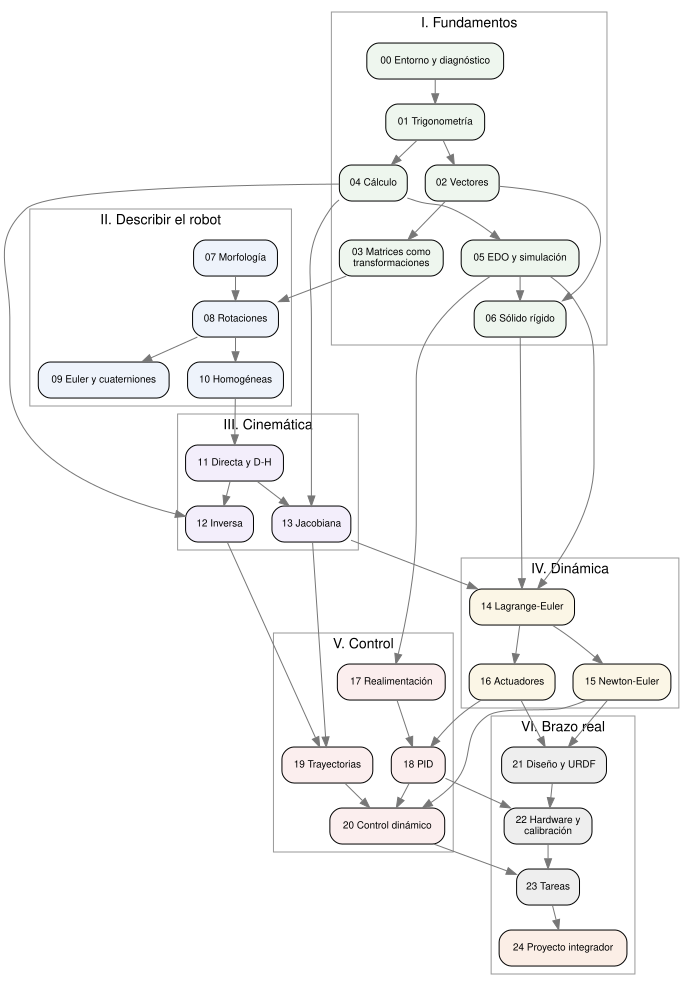

# Estructura del curso de robótica

Curso para diseñar, modelar, simular y controlar un brazo robótico con Python, siguiendo *Fundamentos de Robótica* (Barrientos et al.) y las reglas de [FILOSOFIA.md](FILOSOFIA.md).

## Mapa del curso

| Parte | Pregunta que responde | Bloques |
|---|---|---|
| I. Fundamentos | ¿Con qué herramientas matemáticas y físicas se piensa un robot? | 00 – 06 |
| II. Describir el robot | ¿Qué es un brazo y cómo se dice dónde está cada pieza? | 07 – 10 |
| III. Cinemática | ¿Qué relación hay entre los motores y la pinza? | 11 – 13 |
| IV. Dinámica | ¿Qué fuerzas hacen falta para moverlo? | 14 – 16 |
| V. Control | ¿Cómo se logra que haga lo que se le pide? | 17 – 20 |
| VI. Del modelo al brazo real | ¿Cómo se construye, se programa y se mantiene? | 21 – 24 |

Cada bloque indica: el problema que lo abre, los temas, el ejercicio de romperlo a propósito, el laboratorio, las lecturas y lo que agrega a la librería propia `codigo/robotica/`.

---

## Parte I — Fundamentos: llenar los vacíos

Esta parte existe porque la robótica no es difícil por sí misma: es difícil cuando el álgebra lineal y el cálculo se aprendieron como recetas. Aquí se reconstruyen con el significado geométrico que el resto del curso necesita. Todo ejemplo de la Parte I ya es un problema de robot.

### Bloque 00 — Cómo usar el curso y preparar el entorno

**El problema que lo abre:** empezar un curso sin saber qué se sabe y qué no.

**Temas:**
- Cómo está organizado el curso y cómo leerlo junto a Barrientos.
- **Prueba diagnóstica** de 25 preguntas: trigonometría, vectores, matrices, derivadas, ecuaciones diferenciales, mecánica. Cada pregunta remite al bloque que la cubre.
- Entorno de trabajo: Python, entorno virtual (`venv`), instalación desde `requirements.txt`, editor.
- Python mínimo para el curso: listas, funciones, arreglos de NumPy, una gráfica en Matplotlib.
- La primera figura: un brazo de dos palitos dibujado con Matplotlib, moviéndose con un deslizador.

**Laboratorio:** instalar todo, correr `verificar_entorno.py`, hacer la prueba diagnóstica y anotar la ruta personal de repaso.

**Lectura:** Barrientos, cap. 1 (introducción y un poco de historia).

---

### Bloque 01 — Trigonometría y geometría del plano

**El problema que lo abre:** un brazo plano con dos eslabones de 30 cm y 20 cm. Si el hombro gira 40° y el codo 30°, ¿dónde queda la punta?

**Temas:**
- El radián como la unidad natural (por qué los grados no sirven para derivar).
- Seno y coseno como **proyecciones**, no como razones de un triángulo.
- Identidades que el curso usa de verdad: suma de ángulos, $\sin^2+\cos^2=1$, ley de cosenos.
- `atan2` contra `atan`: por qué `atan` pierde el cuadrante y eso manda un brazo al lado equivocado.
- Coordenadas polares y cartesianas.

**Romperlo a propósito:** calcular la punta con `atan` en vez de `atan2` y con grados en vez de radianes. Ver el brazo "saltar".

**Laboratorio:** cinemática directa del brazo plano 2R escrita a mano y dibujada; espacio de trabajo como nube de puntos.

**Lectura:** cualquier texto de precálculo; Corke, apéndice de geometría.

---

### Bloque 02 — Vectores

**El problema que lo abre:** la punta del brazo está en un punto, pero además empuja con una fuerza en una dirección. ¿Cómo se describe algo que tiene tamaño y dirección, y cómo se calcula el giro que produce?

**Temas:**
- Vector como flecha y como lista de números; cuándo cada visión ayuda.
- Suma, resta, escalamiento. Vector posición contra vector desplazamiento.
- Norma y vector unitario.
- **Producto punto** como proyección: "cuánto de un vector va en la dirección del otro". Ángulo entre vectores. Ortogonalidad.
- **Producto cruz** como el vector perpendicular a dos vectores; su magnitud como área. El torque $\tau = r \times F$.
- Bases y coordenadas: el mismo vector con números distintos según la base.

**Romperlo a propósito:** invertir el orden del producto cruz y observar cómo el torque cambia de sentido.

**Laboratorio:** funciones propias de punto y cruz, comparadas con NumPy; dibujo 3D de vectores y del torque sobre una llave.

**Lectura:** Strang, *Introduction to Linear Algebra*, cap. 1; 3Blue1Brown, *Essence of Linear Algebra*, episodios 1–2.

**Aporta a la librería:** `robotica/vectores.py`.

---

### Bloque 03 — Matrices como transformaciones

**El problema que lo abre:** se sabe multiplicar matrices, pero ¿qué *hace* una matriz a un vector? Sin esa respuesta, toda la Parte II es memorizar.

**Temas:**
- La matriz como máquina que transforma vectores: sus columnas son hacia dónde van los ejes.
- Multiplicación matriz-vector y matriz-matriz como **composición de transformaciones**. Por qué el orden importa ($AB \neq BA$), visto en un dibujo.
- Transpuesta, inversa y cuándo no existe.
- **Determinante** como factor de cambio de área/volumen y su signo como "espejo o no espejo". Determinante cero: la transformación aplasta el espacio (esto regresa como singularidad en el Bloque 13).
- Matrices ortogonales: las que no deforman. Por qué su inversa es su transpuesta.
- Sistemas de ecuaciones lineales, rango y solución por mínimos cuadrados.
- Valores y vectores propios: las direcciones que una matriz solo estira (regresan en el tensor de inercia y en estabilidad).

**Romperlo a propósito:** aplicar dos transformaciones en orden invertido a la imagen de una casita y comparar.

**Laboratorio:** animador de transformaciones 2D en Matplotlib: se escribe una matriz y se ve cómo deforma una cuadrícula.

**Lectura:** 3Blue1Brown, episodios 3–7 y 13–14; Strang, caps. 2–6.

**Aporta a la librería:** `robotica/graficar.py` (dibujar cuadrículas, marcos y transformaciones).

---

### Bloque 04 — Cálculo para cosas que se mueven

**El problema que lo abre:** si cada motor gira a cierta velocidad, ¿a qué velocidad se mueve la punta? La respuesta requiere derivar una función de varias variables que dependen del tiempo.

**Temas:**
- Derivada como velocidad; segunda derivada como aceleración.
- Derivada de un vector y de una matriz (elemento a elemento).
- Derivadas parciales: cuánto cambia la punta si se mueve **solo** un motor.
- **Regla de la cadena** con varias variables: la herramienta que produce la Jacobiana (Bloque 13) y las ecuaciones de Lagrange (Bloque 14).
- Gradiente y la matriz de derivadas parciales.
- Series de Taylor y linealización: aproximar algo curvo por algo recto cerca de un punto.
- Método de Newton-Raphson para resolver ecuaciones que no tienen fórmula.

**Romperlo a propósito:** comparar la derivada analítica contra la derivada numérica con pasos $h$ muy grandes y muy pequeños; ver aparecer el error de redondeo.

**Laboratorio:** derivar la posición del brazo 2R con SymPy; verificar con diferencias finitas en NumPy.

**Lectura:** Stewart, *Cálculo*, capítulos de derivadas parciales y regla de la cadena.

---

### Bloque 05 — Ecuaciones diferenciales y simulación

**El problema que lo abre:** Newton dice cuánto acelera algo, pero lo que se quiere saber es dónde estará dentro de dos segundos.

**Temas:**
- Qué es una ecuación diferencial ordinaria (EDO) y qué significa "resolverla".
- Orden de una EDO y conversión a **sistema de primer orden** (el estado).
- Ejemplos fundacionales: masa-resorte-amortiguador, péndulo simple.
- Solución analítica de EDO lineales de segundo orden: subamortiguado, crítico, sobreamortiguado.
- Solución numérica: método de Euler, Runge-Kutta 4, `scipy.integrate.solve_ivp`.
- Paso de integración, estabilidad numérica y energía que "aparece de la nada".

**Romperlo a propósito:** simular el péndulo con Euler y un paso grande: ver cómo gana energía y termina dando vueltas.

**Laboratorio:** simulador propio de péndulo con Euler y RK4, comparado con `solve_ivp`, con animación.

**Lectura:** Zill, *Ecuaciones diferenciales con aplicaciones de modelado*, caps. 1–5.

**Aporta a la librería:** `robotica/simular.py`.

---

### Bloque 06 — Mecánica del sólido rígido

**El problema que lo abre:** un eslabón de aluminio no es un punto. ¿Qué tan difícil es hacerlo girar y cuánto pesa "dónde"?

**Temas:**
- Leyes de Newton para partículas y para cuerpos.
- Centro de masa.
- Torque y momento angular.
- Momento de inercia; teorema de ejes paralelos (Steiner).
- **Tensor de inercia**: por qué la inercia de un cuerpo en 3D es una matriz; ejes principales como vectores propios.
- Energía cinética de traslación y rotación; energía potencial gravitatoria.
- Fricción viscosa y fricción seca (Coulomb).

**Romperlo a propósito:** calcular la inercia de un eslabón respecto al extremo sin Steiner y comparar con la real.

**Laboratorio:** calcular centro de masa y tensor de inercia de un eslabón simple a mano y con build123d; comparar.

**Lectura:** Beer & Johnston o Hibbeler, *Dinámica*, capítulos de cuerpo rígido.

---

## Parte II — Describir el robot

### Bloque 07 — Morfología del robot

**El problema que lo abre:** antes de calcular nada, hay que poder nombrar las piezas y saber qué puede hacer cada tipo de brazo.

**Temas:**
- Eslabones, articulaciones (rotación y prismática) y cadenas cinemáticas abiertas y cerradas.
- **Grados de libertad**: cuántos hacen falta para ubicar y orientar una pieza (6) y por qué muchos brazos tienen menos.
- Configuraciones clásicas: cartesiano, cilíndrico, polar, SCARA, angular (antropomórfico). Espacio de trabajo de cada uno.
- Muñeca y efector final: pinzas, ventosas, herramientas. TCP.
- Actuadores: motores DC, paso a paso, servomotores; neumáticos e hidráulicos.
- Transmisiones y reductores: engranajes, correas, armónicos; juego mecánico (*backlash*).
- Sensores internos: potenciómetros, encoders incrementales y absolutos, finales de carrera.
- Repetibilidad contra exactitud.

**Laboratorio:** dibujar el espacio de trabajo de un brazo cartesiano, un SCARA y uno angular; clasificar tres brazos comerciales por su hoja de datos.

**Lectura:** Barrientos, cap. 2.

---

### Bloque 08 — Localización espacial I: posición y rotación

**El problema que lo abre:** la pinza está en (0,3; 0,1; 0,2) m. Eso no dice si el huevo cae o no: falta saber hacia dónde apunta.

**Temas:**
- Marco de referencia (sistema de coordenadas) y por qué un robot tiene muchos.
- Coordenadas cartesianas, cilíndricas y esféricas.
- **Matriz de rotación** en el plano y en 3D: sus columnas son los ejes del marco girado vistos desde el marco fijo.
- Rotaciones básicas alrededor de x, y, z.
- Composición de rotaciones: **ejes fijos (premultiplicar) contra ejes móviles (posmultiplicar)**.
- Propiedades: ortogonal, determinante +1, inversa = transpuesta.
- Por qué 9 números describen solo 3 GDL de orientación.

**Romperlo a propósito:** componer las mismas dos rotaciones premultiplicando y posmultiplicando; ver la pinza terminar en lugares distintos. Hacer una matriz con determinante −1 y ver el marco "en espejo".

**Laboratorio:** funciones `rotx`, `roty`, `rotz`; visualizador 3D de marcos con colores fijos x-y-z; comparación con `scipy.spatial.transform.Rotation`.

**Lectura:** Barrientos, cap. 3 (primera parte); Lynch & Park, *Modern Robotics*, cap. 3.

**Aporta a la librería:** `robotica/rotaciones.py`.

---

### Bloque 09 — Localización espacial II: otras formas de decir la orientación

**El problema que lo abre:** un operador no puede escribir una matriz de 3×3 en una pantalla, y un giroscopio integrando matrices termina con algo que ya no es una rotación.

**Temas:**
- **Ángulos de Euler**: convenciones ZXZ y roll-pitch-yaw (alabeo-cabeceo-guiñada). Hay 12 convenciones y cada fabricante usa la suya.
- Bloqueo del cardán (*gimbal lock*): por qué se pierde un grado de libertad.
- **Par de rotación** (eje y ángulo): toda rotación es un solo giro alrededor de algún eje. Fórmula de Rodrigues.
- **Cuaterniones**: qué son sin misticismo, cómo representan un giro, cómo se componen, por qué no se traban.
- Conversiones entre todas las representaciones y cuándo usar cada una.
- Interpolar orientaciones: por qué interpolar ángulos de Euler da giros raros y SLERP no.

**Romperlo a propósito:** llevar el cabeceo a 90° y tratar de girar la guiñada; ver el bloqueo. Interpolar entre dos orientaciones con Euler y con SLERP, y animar ambas.

**Laboratorio:** conversor propio entre las cuatro representaciones, verificado ida y vuelta.

**Lectura:** Barrientos, cap. 3; Corke, *Robotics, Vision and Control* (ed. Python), cap. 2.

**Dónde más aparece:** IMU de drones y celulares, animación 3D, videojuegos, naves espaciales.

**Aporta a la librería:** `robotica/orientacion.py`.

---

### Bloque 10 — Matrices de transformación homogénea

**El problema que lo abre:** la cámara ve el huevo; la cámara está en la base; la base está en la mesa. ¿Dónde está el huevo respecto a la pinza? Rotaciones y traslaciones por separado se vuelven un enredo.

**Temas:**
- Coordenadas homogéneas: el truco de agregar un 1.
- Matriz $4\times4$ que junta rotación y traslación.
- Interpretaciones: describir un marco, cambiar de coordenadas, mover un objeto.
- Composición y encadenamiento de transformaciones.
- **Inversa de una transformación homogénea** sin invertir la matriz completa.
- Grafos de transformaciones: cerrar el ciclo para despejar lo desconocido.
- Comparación de representaciones (tabla de Barrientos).

**Romperlo a propósito:** invertir la $4\times4$ transponiéndola (error clásico) y ver el marco salir volando.

**Laboratorio:** escena mesa-base-cámara-huevo-pinza con su grafo en Graphviz; calcular la pose del huevo vista desde la pinza.

**Lectura:** Barrientos, cap. 3; Craig, *Introduction to Robotics*, cap. 2.

**Aporta a la librería:** `robotica/homogeneas.py`.

---

## Parte III — Cinemática

### Bloque 11 — Cinemática directa y Denavit-Hartenberg

**El problema que lo abre:** se conocen los ángulos de todos los motores. ¿Dónde está la pinza y hacia dónde apunta?

**Temas:**
- Cinemática directa por geometría (brazo 2R) y por qué no escala a seis eslabones.
- **Convención de Denavit-Hartenberg**: las reglas para poner los marcos y los cuatro parámetros $\theta, d, a, \alpha$, cada uno con su significado físico.
- Algoritmo de Barrientos paso a paso (DH1 a DH16).
- La matriz $^{i-1}A_i$ y la matriz total $T = {}^0A_1\,{}^1A_2 \cdots$.
- Casos resueltos: 2R plano, 3R antropomórfico, SCARA, brazo de 4 GDL del proyecto.
- **D-H estándar contra D-H modificado (Craig)**: por qué dos libros dan tablas distintas para el mismo robot.
- Dónde más aparece: el producto de exponenciales (Lynch & Park), otra forma de hacer lo mismo sin marcos intermedios.

**Romperlo a propósito:** cambiar el signo de un $\alpha$; usar una tabla D-H modificada con la fórmula estándar.

**Laboratorio:** función D-H propia (SymPy para ver la fórmula, NumPy para evaluar); comparar con `roboticstoolbox.DHRobot`; animar el brazo con deslizadores por articulación.

**Lectura:** Barrientos, cap. 4 (cinemática directa); Spong, Hutchinson & Vidyasagar, *Robot Modeling and Control*, capítulo de cinemática directa.

**Aporta a la librería:** `robotica/dh.py`, `robotica/brazo.py` (clase que guarda la tabla D-H).

---

### Bloque 12 — Cinemática inversa

**El problema que lo abre:** el huevo está en un punto de la cubeta. ¿Cuánto debe girar cada motor? Esta es la pregunta que de verdad hace quien usa un robot.

**Temas:**
- Por qué es más difícil que la directa: puede haber varias soluciones, infinitas o ninguna.
- **Método geométrico**: el brazo 2R con ley de cosenos; codo arriba y codo abajo.
- Método a partir de la matriz de transformación homogénea.
- **Desacoplo cinemático**: separar posición (brazo) de orientación (muñeca) cuando la muñeca es esférica.
- Métodos numéricos: Newton-Raphson, Jacobiana transpuesta y mínimos cuadrados amortiguados (*damped least squares*).
- Elegir entre soluciones: límites articulares, cercanía a la posición actual.
- Puntos fuera del espacio de trabajo: detectarlos antes de mandar el motor.

**Romperlo a propósito:** pedir un punto fuera de alcance y ver qué devuelve cada método; arrancar Newton-Raphson desde una semilla mala.

**Laboratorio:** cinemática inversa analítica del 2R y del brazo del proyecto; numérica genérica; verificación cerrando el ciclo (inversa → directa → debe dar el punto pedido).

**Lectura:** Barrientos, cap. 4 (cinemática inversa); Lynch & Park, cap. 6.

**Aporta a la librería:** `robotica/inversa.py`.

---

### Bloque 13 — Cinemática diferencial: la matriz Jacobiana

**El problema que lo abre:** se quiere mover la pinza en línea recta a 5 cm/s. ¿A qué velocidad debe girar cada motor en cada instante? Y en ciertas posturas, ¿por qué la respuesta es "infinito"?

**Temas:**
- Relación entre velocidades articulares y velocidades de la pinza: $\dot{x} = J(q)\,\dot{q}$.
- **Jacobiana analítica** (derivando la cinemática directa) y **Jacobiana geométrica** (con los ejes de cada articulación).
- Jacobiana inversa y pseudoinversa.
- **Singularidades**: determinante cero, pérdida de un grado de libertad, velocidades explosivas. Singularidades de frontera y de interior.
- Manipulabilidad: qué tan "cómodo" está el brazo en una postura.
- **Estática**: $\tau = J^T F$, el par que necesita cada motor para sostener una carga en la pinza.
- Dónde más aparece: sensibilidad en ingeniería, redes neuronales (retropropagación), método de Newton.

**Romperlo a propósito:** llevar el brazo 2R a brazo estirado y pedir una velocidad hacia afuera; graficar las velocidades articulares.

**Laboratorio:** Jacobiana simbólica y numérica; mapa de manipulabilidad sobre el espacio de trabajo; cálculo del par de sostenimiento para un huevo y para la pinza.

**Lectura:** Barrientos, cap. 4 (matriz Jacobiana); Lynch & Park, cap. 5.

**Aporta a la librería:** `robotica/jacobiana.py`.

---

## Parte IV — Dinámica

### Bloque 14 — Dinámica por Lagrange-Euler

**El problema que lo abre:** la simulación cinemática mueve el brazo perfecto. El brazo real no llega, oscila o el servo se quema. Falta saber qué par necesita cada motor.

**Temas:**
- Dinámica inversa (movimiento → pares) y dinámica directa (pares → movimiento).
- El lagrangiano $L = K - U$ y la ecuación de Lagrange, deducida paso a paso.
- Péndulo simple y doble como primeros casos.
- Brazo 2R completo.
- Forma general: $M(q)\ddot{q} + C(q,\dot{q})\dot{q} + G(q) = \tau$. Significado físico de cada término: inercia, efectos centrífugos y de Coriolis, gravedad.
- Propiedades útiles de $M$: simétrica y definida positiva.

**Romperlo a propósito:** eliminar el término de Coriolis y simular un movimiento rápido; comparar con el modelo completo.

**Laboratorio:** deducción automática con SymPy del modelo del 2R; simulación con `solve_ivp`; verificación de conservación de energía sin fricción.

**Lectura:** Barrientos, cap. 5; Spong et al., capítulo de dinámica.

**Aporta a la librería:** `robotica/dinamica.py` (Lagrange simbólico).

---

### Bloque 15 — Dinámica por Newton-Euler y simulación

**El problema que lo abre:** Lagrange produce ecuaciones enormes para 4 GDL o más, y un controlador necesita el par en milisegundos.

**Temas:**
- Algoritmo recursivo de Newton-Euler: velocidades hacia afuera, fuerzas hacia adentro.
- Costo computacional comparado con Lagrange.
- Dinámica directa para simular.
- Modelo en espacio de estados del brazo.
- Parámetros dinámicos y cómo obtenerlos: del CAD, midiendo, identificando.

**Romperlo a propósito:** poner un tensor de inercia no simétrico o una masa negativa; ver cómo diverge la simulación.

**Laboratorio:** Newton-Euler propio comparado con Lagrange (deben coincidir) y con `rne()` de Robotics Toolbox; simulación en PyBullet del mismo brazo.

**Lectura:** Barrientos, cap. 5; Craig, capítulo de dinámica.

---

### Bloque 16 — Actuadores, transmisiones y dimensionamiento

**El problema que lo abre:** el modelo dice que el hombro necesita 2,3 N·m. ¿Qué motor se compra y con qué reductor?

**Temas:**
- Modelo del motor DC: parte eléctrica y parte mecánica; constante de par y de velocidad.
- Reductores: cómo multiplican par, dividen velocidad y **reflejan inercia** ($N^2$).
- Servomotores de aficionado por dentro: motor, reductor, potenciómetro y un controlador P.
- Motores paso a paso: pasos perdidos y por qué no avisan.
- Fricción, juego mecánico y rigidez.
- **Dimensionamiento**: par pico, par RMS, velocidad, margen de seguridad, curva par-velocidad.

**Romperlo a propósito:** elegir el servo solo por el par estático y simular el movimiento rápido; ver dónde se satura.

**Laboratorio:** hoja de dimensionamiento en Python para las articulaciones del brazo del proyecto, a partir de las trayectorias y la dinámica.

**Lectura:** Barrientos, caps. 2 y 5 (modelo de actuadores); hojas de datos de fabricantes.

---

## Parte V — Control

### Bloque 17 — Sistemas y realimentación

**El problema que lo abre:** se manda el ángulo exacto y el brazo no llega, porque el modelo nunca es perfecto y siempre hay perturbaciones. Hay que medir y corregir.

**Temas:**
- Lazo abierto y lazo cerrado: la idea de medir el error.
- Transformada de Laplace sin miedo: una herramienta para convertir EDO en álgebra.
- Función de transferencia, polos y ceros.
- Respuesta al escalón: tiempo de subida, sobrepaso, tiempo de establecimiento, error en estado estacionario.
- Estabilidad: la ubicación de los polos.
- Diagramas de bloques.
- Dónde más aparece: el control de temperatura de un galpón, el termostato, la ducha.

**Romperlo a propósito:** meter un retardo en el lazo y ver cómo un sistema estable empieza a oscilar.

**Laboratorio:** modelo de una articulación (motor + reductor + eslabón) en python-control; respuesta al escalón en lazo abierto y cerrado.

**Lectura:** Ogata, *Ingeniería de control moderna*, caps. 1–5; Åström & Murray, *Feedback Systems* (libre).

---

### Bloque 18 — Control PID de una articulación

**El problema que lo abre:** un controlador proporcional deja al brazo colgando un poco por debajo, y si se sube la ganancia empieza a vibrar.

**Temas:**
- Acción proporcional, integral y derivativa: qué corrige cada una y qué problema trae.
- Control monoarticular: cada motor con su propio lazo, el resto como perturbación.
- Sintonía: a mano, Ziegler-Nichols, por ubicación de polos.
- Saturación del actuador y **efecto *windup*** de la integral; anti-*windup*.
- Derivada del error contra derivada de la medición; filtrado del ruido.
- **Control digital**: periodo de muestreo, discretización, implementación en un microcontrolador.

**Romperlo a propósito:** saturar el actuador con integral sin anti-*windup*; muestrear demasiado lento.

**Laboratorio:** PID propio discreto en Python sobre la articulación simulada; la misma función portada a C para el microcontrolador.

**Lectura:** Barrientos, cap. 7 (control monoarticular); Åström & Murray, capítulo de PID.

**Aporta a la librería:** `robotica/control.py`.

---

### Bloque 19 — Generación de trayectorias

**El problema que lo abre:** si se le manda al brazo "ve a este punto" de golpe, arranca con aceleración infinita, sacude la estructura y el huevo sale volando.

**Temas:**
- Trayectoria en el espacio articular contra el espacio cartesiano; ventajas de cada una.
- Interpoladores: lineal, polinomio cúbico, polinomio de quinto orden (velocidad y aceleración controladas).
- Perfil trapezoidal de velocidad y perfil en S (*jerk* limitado).
- Trayectorias con puntos intermedios: *splines*.
- Línea recta cartesiana usando cinemática inversa en cada instante; qué pasa cerca de una singularidad.
- Muestreo de la trayectoria y relación con el periodo del controlador.

**Romperlo a propósito:** cruzar una singularidad con una recta cartesiana; usar un escalón en vez de una trayectoria y medir el par pico.

**Laboratorio:** generador de trayectorias propio; comparación de perfiles graficando posición, velocidad, aceleración y par requerido.

**Lectura:** Barrientos, cap. 6; Lynch & Park, cap. 9.

**Aporta a la librería:** `robotica/trayectorias.py`.

---

### Bloque 20 — Control dinámico del brazo completo

**El problema que lo abre:** con PID independientes, el brazo sigue bien en movimientos lentos y mal en rápidos, porque cada eslabón empuja a los otros.

**Temas:**
- Limitaciones del control independiente por articulación.
- Control PD con **compensación de gravedad**: por qué funciona y cómo demostrarlo.
- **Par calculado** (*computed torque*): usar el modelo para linealizar el brazo.
- Prealimentación (*feedforward*) más realimentación.
- Robustez: qué pasa cuando el modelo está mal (masa del huevo, carga desconocida).
- Nociones de control adaptativo y de fuerza (hasta dónde llega el curso).

**Romperlo a propósito:** usar par calculado con una masa del modelo 30 % equivocada.

**Laboratorio:** comparar PID independiente, PD + gravedad y par calculado sobre la misma trayectoria en simulación y en PyBullet.

**Lectura:** Barrientos, cap. 7; Spong et al., capítulos de control multivariable.

---

## Parte VI — Del modelo al brazo real

### Bloque 21 — Diseño mecánico y modelo digital

**El problema que lo abre:** las tablas y ecuaciones describen un brazo ideal. Hay que diseñar uno que se pueda fabricar y cuyo modelo digital coincida con el real.

**Temas:**
- Del requisito al diseño: alcance, carga, velocidad, precisión.
- Modelado paramétrico con build123d: eslabones que cambian al cambiar la tabla D-H.
- Masas, centros de masa e inercias desde el CAD hacia el modelo dinámico.
- Formato URDF (*Unified Robot Description Format*) para describir el robot a los simuladores.
- Simulación en PyBullet con el modelo real.

**Laboratorio:** modelo paramétrico del brazo del proyecto; exportar URDF; verificar que PyBullet, Robotics Toolbox y la librería propia den la misma cinemática.

**Lectura:** documentación de build123d y de URDF.

---

### Bloque 22 — Hardware, calibración y seguridad

**El problema que lo abre:** el modelo dice 0°, el servo dice 0°, y el brazo físico está torcido 7°.

**Temas:**
- Arquitectura: Python en el computador (planificación) y microcontrolador (lazos de control).
- Comunicación serie: protocolo simple con encabezado, datos y verificación.
- Calibración: ceros de cada articulación, sentido de giro, relación entre la señal y el ángulo.
- Lectura de sensores: potenciómetros, encoders, ruido.
- Errores que el modelo no ve: juego mecánico, flexión, alimentación insuficiente.
- **Seguridad**: límites articulares por software, parada de emergencia, qué hacer al perder comunicación.

**Romperlo a propósito:** invertir el sentido de giro de una articulación en la calibración y ver cómo falla la cinemática inversa.

**Laboratorio:** calibrar el brazo físico y medir el error de posición en una rejilla de puntos.

**Lectura:** Barrientos, cap. 9 (criterios de implantación y seguridad).

---

### Bloque 23 — Programación de tareas

**El problema que lo abre:** el brazo ya se mueve bien. Ahora tiene que hacer un trabajo repetido todo el día sin supervisión.

**Temas:**
- Niveles de programación: guiado (enseñar puntos) y textual.
- Puntos de enseñanza (*teach points*) y trayectorias guardadas.
- La tarea como **máquina de estados**: esperar, aproximar, tomar, levantar, trasladar, dejar, regresar.
- Manejo de errores: objeto no encontrado, fallo de agarre, cubeta llena.
- Tiempo de ciclo y cómo reducirlo.

**Laboratorio:** tarea de recoger y dejar (*pick and place*) en simulación, con máquina de estados y registro de eventos.

**Lectura:** Barrientos, caps. 8 y 10.

---

### Bloque 24 — Proyecto integrador

Diseñar, modelar, simular, construir y controlar un brazo de 4 GDL que recoge huevos a la salida de una clasificadora y los acomoda en una cubeta de 30.

**Entregables:**
1. Especificación: alcance, carga, tiempo de ciclo, precisión.
2. Tabla D-H, cinemática directa, inversa y Jacobiana, con verificación cruzada.
3. Modelo dinámico y dimensionamiento de motores.
4. Modelo CAD paramétrico y URDF.
5. Generador de trayectorias y controlador, validados en simulación.
6. Brazo físico calibrado con error de posición medido.
7. Programa de la tarea como máquina de estados.
8. **Manual de mantenimiento y diagnóstico**: tabla de síntomas, causas probables y cómo verificar cada una, siguiendo la cadena de diagnóstico de la filosofía.

---

## Anexos

| Anexo | Contenido |
|---|---|
| A — Glosario | Todos los términos del curso, alimentado por el glosario de cada bloque. |
| B — Notación y convenciones | Símbolos, unidades, colores de ejes, correspondencia con la notación de otros libros. |
| C — Entorno de trabajo | Instalación paso a paso, entorno virtual y conflictos de versiones conocidos. |
| D — Formulario | Trigonometría, álgebra lineal, derivadas y transformadas usadas en el curso, en una sola hoja. |
| E — Bibliografía y correspondencia | Qué capítulo de cada libro cubre cada bloque. |
| F — Deducciones completas | Las deducciones largas que interrumpirían la lectura de un bloque. |

## Bibliografía

**Texto base**
- Barrientos, A., Peñín, L. F., Balaguer, C. y Aracil, R. *Fundamentos de Robótica*, 2.ª ed. McGraw-Hill, 2007. (La numeración de capítulos del curso sigue esta edición; verificar con el ejemplar propio.)

**Robótica complementaria**
- Corke, P. *Robotics, Vision and Control: Fundamental Algorithms in Python*. Springer, 2023. Usa las mismas librerías del curso.
- Lynch, K. y Park, F. *Modern Robotics: Mechanics, Planning, and Control*. Cambridge, 2017. PDF y videos libres.
- Spong, M., Hutchinson, S. y Vidyasagar, M. *Robot Modeling and Control*, 2.ª ed. Wiley, 2020.
- Craig, J. *Introduction to Robotics: Mechanics and Control*. Pearson. (Usa D-H modificado.)

**Fundamentos**
- Strang, G. *Introduction to Linear Algebra*.
- 3Blue1Brown. *Essence of Linear Algebra* y *Essence of Calculus* (videos).
- Stewart, J. *Cálculo de varias variables*.
- Zill, D. *Ecuaciones diferenciales con aplicaciones de modelado*.
- Beer, F. y Johnston, E. *Mecánica vectorial para ingenieros: Dinámica*.
- Ogata, K. *Ingeniería de control moderna*.
- Åström, K. y Murray, R. *Feedback Systems*. Libre.
