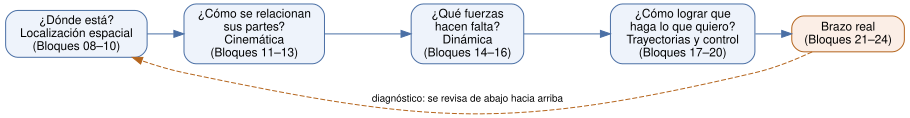

# Filosofía del curso de robótica

Este documento fija las reglas con las que se escribe cada bloque del curso. Si un bloque contradice algo de aquí, se corrige el bloque.

El texto base es *Fundamentos de Robótica* de Antonio Barrientos y otros (McGraw-Hill, 2.ª ed.). El curso no lo reemplaza ni lo resume: lo **acompaña**. Cada bloque dice qué capítulo leer, llena los pasos que el libro da por sabidos y lleva cada idea hasta el código y el brazo real. Donde otro libro lo explica mejor, se usa ese libro (ver Anexo E).

## 1. A quién va dirigido

El estudiante tipo cursa tercer o cuarto semestre de ingeniería. Sabe **operar** matrices (multiplicar, sacar determinantes), álgebra, cálculo diferencial e integral básico y física mecánica general. Sabe programar lo básico en algún lenguaje (variables, ciclos, funciones). Usa Linux como usuario.

Pero **tiene vacíos**, y el curso lo asume de frente. Saber calcular un determinante no es lo mismo que saber qué significa. El caso típico es alguien que aprobó álgebra lineal haciendo cuentas sin ver nunca una matriz como algo que *mueve* vectores, y que luego se perdió en la clase de robótica porque el profesor daba eso por entendido.

**No se asume nada más.** No se asume que sabe qué es un producto cruz en la práctica, qué es un marco de referencia, qué es una ecuación diferencial más allá de resolverla por receta, ni qué es un polo de un sistema. El curso debe poder leerse de principio a fin sin buscar términos por fuera.

El Bloque 00 incluye una **prueba diagnóstica**: cada pregunta indica qué bloque de la Parte I repasar si se falla. Nadie tiene que leer lo que ya domina, pero nadie avanza con un hueco sin saberlo.

## 2. Principio central: entender por qué existe cada cosa

Cada herramienta de la robótica existe porque resuelve un problema concreto. Por eso el curso no presenta una herramienta hasta que el estudiante siente el problema que la hace necesaria.

- La **matriz de rotación** aparece cuando decir "la pinza está en (x, y, z)" no basta, porque también importa *hacia dónde apunta*.
- La **matriz de transformación homogénea** aparece cuando hay que encadenar rotaciones y traslaciones, y llevar la cuenta por separado se vuelve un desastre.
- Los **cuaterniones** aparecen cuando los ángulos de Euler se traban (*gimbal lock*) y cuando nueve números para describir tres grados de libertad empiezan a acumular error.
- **Denavit-Hartenberg** aparece cuando describir un brazo de seis eslabones con seis números por eslabón es inmanejable, y hace falta un método que siempre dé el mismo resultado con cuatro.
- La **cinemática inversa** aparece con la pregunta real del usuario: "sé dónde quiero la pinza, ¿cuánto giro cada motor?".
- La **matriz Jacobiana** aparece cuando se quiere mover la pinza en línea recta a velocidad constante y resulta que los motores no pueden girar a velocidad constante.
- La **dinámica** aparece cuando el brazo simulado se mueve perfecto pero el real se cae, porque nadie calculó el par que necesita cada motor.
- El **control** aparece cuando el modelo, por bueno que sea, nunca es exacto.

Para cada concepto el curso responde cuatro preguntas:

1. **¿Qué problema resuelve?**
2. **¿Cómo funciona por dentro?** (el mecanismo y su deducción)
3. **¿Cómo se aplica en la vida real?** (en Python y en un brazo físico)
4. **¿Dónde más aparece esta idea?** (en gráficos 3D, drones, GPS, circuitos, control de temperatura, la vida cotidiana)

## 3. Ningún término sin definir

- Todo término técnico se define **la primera vez que aparece**, en lenguaje llano, antes de dar la definición formal.
- Se usa primero una **analogía** y luego se dice **dónde falla la analogía**.
- Las siglas se expanden siempre la primera vez: GDL (grados de libertad), D-H (Denavit-Hartenberg), TCP (*Tool Center Point*, punto central de la herramienta).
- Cada bloque termina con un **glosario del bloque**, y todos alimentan el glosario general (Anexo A).
- Si un bloque necesita un término de un bloque posterior, se da una definición mínima y se indica dónde se profundiza.
- **Cada símbolo matemático se define al usarlo**, con sus unidades. Una fórmula con un símbolo sin explicar se considera un error del curso. La notación completa está en el Anexo B.

## 4. La cadena como columna vertebral

Las redes se estudian por capas. La robótica se estudia como una **cadena de preguntas**, donde cada eslabón necesita el anterior:

1. **¿Dónde está?** — Localización espacial: posición y orientación de cada pieza.
2. **¿Cómo se relacionan sus partes?** — Cinemática: de ángulos de motor a posición de la pinza, y al revés.
3. **¿Qué fuerzas hacen falta?** — Dinámica: de movimiento deseado a par en cada motor.
4. **¿Cómo lograr que haga lo que quiero?** — Trayectorias y control: corregir la diferencia entre lo que se pidió y lo que pasó.

Cada eslabón es un **bloque tipo Lego**: recibe algo del anterior (una posición, un ángulo, una velocidad) y entrega algo al siguiente. Si un eslabón está mal, todos los de arriba fallan aunque estén perfectos.

La cadena también es **la herramienta de diagnóstico**. Cuando el brazo no llega donde debe, se revisa de abajo hacia arriba:

1. ¿Unidades? (grados contra radianes, mm contra m)
2. ¿Marcos de referencia? (¿dónde está el cero?, ¿hacia dónde apunta cada eje?)
3. ¿Parámetros D-H? (¿convención estándar o modificada?)
4. ¿Rama de la cinemática inversa? (¿codo arriba o codo abajo?)
5. ¿Singularidad? (¿el determinante de la Jacobiana se acerca a cero?)
6. ¿Dinámica? (¿masas, inercias, fricción?)
7. ¿Control? (¿ganancias, saturación, periodo de muestreo?)

## 5. Estructura fija de cada tema

Dentro de cada bloque, cada tema sigue este orden (plantilla en `bloques/_plantilla_bloque.md`):

1. **El problema.** Una situación concreta donde falta la pieza.
2. **El mecanismo.** Cómo funciona, con esquema y con la deducción paso a paso. No se salta ningún paso algebraico "evidente": justo ahí es donde se pierde el ritmo.
3. **En la vida real.** Cómo se ve en código y en un brazo real.
4. **Limitaciones.** Supuestos que se rompen: sólido rígido, sin juego mecánico, sin fricción, ángulos pequeños.
5. **Fallas típicas y diagnóstico.** Qué síntomas produce cuando está mal, cómo se detecta y cómo se corrige. Obligatorio: el curso forma a alguien capaz de **depurar** un robot, no solo de dibujarlo.
6. **Dónde más aparece la idea.**
7. **Ejemplos resueltos.** Primero a mano, luego verificados con código.
8. **Ejercicios propuestos**, en tres series:
   - **Serie A — Conceptuales:** explicar con palabras propias, predecir qué pasa, dibujar.
   - **Serie B — Cálculo a mano:** matrices, tablas D-H, Jacobianas, ecuaciones de movimiento. Con lápiz.
   - **Serie C — Laboratorio:** Python, simulación y, cuando aplica, el brazo físico.

## 6. Primero a mano, luego construido, luego con librería

Una librería de robótica calcula la cinemática directa en una línea. Lo difícil es saber **si el resultado está bien** y **qué pasó cuando está mal**. Por eso cada herramienta pasa por tres etapas:

1. **A mano**, en un caso pequeño (un brazo plano de dos eslabones), hasta que el resultado se pueda predecir antes de calcularlo.
2. **Construida por el estudiante**, en su propia librería `codigo/robotica/`, que crece bloque a bloque: rotaciones, transformaciones, D-H, cinemática inversa, Jacobiana, dinámica. Primero con SymPy (simbólico, para *ver* la fórmula) y luego con NumPy (numérico, para *usarla*).
3. **Con la librería profesional** (Robotics Toolbox, spatialmath), **comparando** su resultado con el propio. Si no coinciden, no se sigue hasta saber por qué.

Cada herramienta se acompaña de un ejercicio de **"romperlo a propósito"**: invertir el orden de dos rotaciones, cambiar un parámetro D-H de signo, meter grados donde van radianes, poner una ganancia demasiado alta. Se observa el síntoma y se aprende a reconocerlo cuando ocurra de verdad.

## 7. Herramientas reales y libres

Todo el curso se trabaja en **Linux con Python y software libre**:

| Propósito | Herramientas |
|---|---|
| Cálculo numérico | NumPy, SciPy |
| Cálculo simbólico (deducir fórmulas) | SymPy |
| Gráficas y animaciones | Matplotlib |
| Rotaciones y transformaciones | `scipy.spatial.transform`, spatialmath-python |
| Modelos de robots | Robotics Toolbox for Python |
| Control | python-control |
| Simulación física | PyBullet (o MuJoCo) |
| Diseño mecánico paramétrico | build123d |
| Comunicación con el hardware | pySerial |
| Esquemas del curso | schemdraw, Graphviz, Matplotlib |

Matplotlib es la herramienta central del curso: permite **ver** cada transformación, cada marco de referencia y cada trayectoria. Ninguna matriz se deja sin dibujar lo que hace.

## 8. Del mecanismo general a la aplicación real

El orden va de lo general a lo concreto y termina en un **proyecto integrador**: diseñar, modelar, simular, construir y controlar un brazo robótico de 4 GDL que recoge huevos a la salida de una clasificadora y los acomoda en una cubeta de 30, dejando documentado su modelo, su calibración y su procedimiento de mantenimiento.

## 9. Convenciones de escritura

- **Idioma:** español. Los términos en inglés se dan entre paréntesis y en cursiva la primera vez, porque son los que aparecen en la literatura y en las librerías.
- **Archivos:** un archivo Markdown por bloque, en `bloques/`, con nombre `bloque_NN_tema.md`. Los anexos van en `anexos/` como `anexo_X_tema.md`.
- **Código:** en `codigo/`. Los scripts de cada bloque van en `codigo/bloque_NN/`; la librería propia en `codigo/robotica/`. Cada script corre solo, sin editar nada, y dice qué debe mostrar.
- **Imágenes y esquemas:** todos en `recursos/`. El código fuente de cada esquema (Graphviz `.dot`, Python con schemdraw o Matplotlib) se guarda en `recursos/esquemas/` y la imagen generada en `recursos/imagenes/`. Nunca se sube una imagen sin su fuente. Ver `recursos/README.md`.
- **Matemática:** en notación LaTeX de GitHub (`$...$` y `$$...$$`). Aquí la matemática no es decorativa: es el contenido. Toda ecuación importante se acompaña de una frase que diga qué significa y de un caso numérico.
- **Unidades:** Sistema Internacional. Ángulos en **radianes** en todo cálculo y todo código; los grados solo se usan para mostrarle un valor a una persona. Longitudes en metros en los modelos y en milímetros solo en planos mecánicos.
- **Marcos de referencia:** siempre dextrógiros (regla de la mano derecha). Colores fijos en todos los dibujos: **x rojo, y verde, z azul**.
- **Notación:** la de Barrientos, para que el libro y el curso se lean juntos. Cuando otro texto use otra notación (por ejemplo, D-H modificado de Craig), se advierte explícitamente y se da la equivalencia.
- **Referencias:** cada bloque cita el capítulo de Barrientos y al menos una fuente complementaria. El estudiante aprende a contrastar dos explicaciones del mismo tema.
