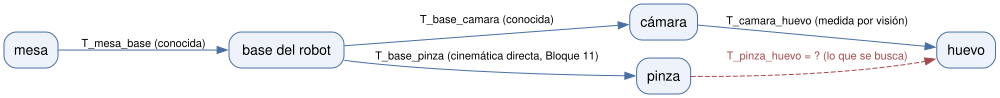

# Bloque 10 — Matrices de transformación homogénea

> **Problema que abre el bloque:** la cámara ve el huevo; la cámara está en la base; la base está en la mesa. ¿Dónde está el huevo respecto a la pinza?
>
> **Necesitas antes:** Bloque 09. · **Lectura:** Barrientos, cap. 3; Craig, *Introduction to Robotics*, cap. 2.

Este bloque porta `transl` y `es_homogenea` de `transformaciones.py` de
[`robotica-manipuladores`](https://github.com/eamadosuarez83/robotica-manipuladores) — ver
[docs/integracion_manipuladores.md](../docs/integracion_manipuladores.md). Aquí es también donde
se **junta** lo que los Bloques 08 y 09 mantuvieron deliberadamente separado (rotación pura de
3×3): a partir de este bloque, rotación y traslación viajan siempre combinadas en una sola matriz
4×4, igual que en `robotica-manipuladores` desde el principio.

## Tema 10.1 — Coordenadas homogéneas: el truco de agregar un 1

### 1. El problema

Rotar un punto es multiplicarlo por una matriz ($R\vec v$, Bloque 08); trasladarlo es sumarle un vector ($\vec v+\vec p$). Son dos operaciones de naturaleza distinta —una multiplicación y una suma— y no hay forma directa de combinarlas en una sola multiplicación de matriz, que es lo que hace falta para encadenar muchas transformaciones sin que la fórmula crezca sin control (Bloque 11: un brazo de 6 eslabones tendría que sumar y multiplicar seis veces intercaladamente, a mano).

### 2. El mecanismo

El truco: agregar una cuarta componente, siempre igual a 1, a cada punto. Un punto $(x,y,z)$ pasa a ser $(x,y,z,1)$ — sus **coordenadas homogéneas**. Con esa componente extra, una multiplicación matricial de $4\times4$ puede representar rotación *y* traslación a la vez:

$$\begin{pmatrix}\vec v' \\ 1\end{pmatrix} = \begin{pmatrix}R & \vec p \\ \vec 0^T & 1\end{pmatrix}\begin{pmatrix}\vec v \\ 1\end{pmatrix} = \begin{pmatrix}R\vec v+\vec p \\ 1\end{pmatrix}$$

La última fila $(\vec 0^T,1)$ multiplicada por $(\vec v,1)$ siempre da $1$: por eso la cuarta componente del resultado también es $1$, y el punto sigue siendo un punto homogéneo válido después de la transformación — la construcción es consistente consigo misma sin importar cuántas veces se repita.

### 3. En la vida real

```python
v_homogeneo = np.append(v, 1)      # (x,y,z) -> (x,y,z,1)
v_transformado = (T @ v_homogeneo)[:3]   # de vuelta a (x,y,z)
```

### 4. Limitaciones

La cuarta componente distingue **puntos** (siempre 1) de **direcciones o vectores libres** (siempre 0, porque un desplazamiento no tiene "posición propia" que trasladar — Bloque 02, Tema 2.1): $(\vec v,0)$ se rota pero no se traslada al aplicar $T$. Confundir ambos casos es un error real, no solo teórico.

### 5. Fallas típicas y diagnóstico

| Síntoma | Causa probable | Cómo verificar | Corrección |
|---|---|---|---|
| Un vector de dirección (por ejemplo, la velocidad de la punta) se traslada cuando no debería | Se le agregó un 1 en vez de un 0 en la cuarta componente | Revisar si la cantidad es una posición (1) o un desplazamiento/dirección (0) | Usar 0 en la cuarta componente para vectores libres, 1 para puntos |

### 6. Dónde más aparece la idea

Gráficos por computadora (OpenGL, DirectX: toda la tubería de renderizado usa coordenadas homogéneas), visión artificial (proyección de cámara), CAD.

### 7. Ejemplos resueltos

**Ejemplo:** el punto $(2,0,0)$ en coordenadas homogéneas es $(2,0,0,1)$; la dirección "hacia adelante" $(1,0,0)$, si es un desplazamiento libre (no un punto), es $(1,0,0,0)$.

### 8. Ejercicios

**Serie A — Conceptuales**
- A1. Explicar por qué la velocidad de un punto (Bloque 04) debe tratarse como $(\vec v,0)$ y no como $(\vec v,1)$ al transformarla entre marcos.

**Serie B — Cálculo a mano**
- B1. Escribir en coordenadas homogéneas el punto $(1,2,3)$ y la dirección $(0,1,0)$.

**Serie C — Laboratorio**
- C1. Verificar en Python que aplicar una matriz de traslación pura a $(\vec v,0)$ no cambia $\vec v$, pero aplicada a $(\vec v,1)$ sí.

---

## Tema 10.2 — La matriz homogénea 4×4

### 1. El problema

Con el truco del Tema 10.1 ya se puede escribir la matriz completa; falta fijar su forma exacta y, sobre todo, poder **leerla** de un vistazo, igual que se aprendió a leer una matriz de rotación en el Bloque 08.

### 2. El mecanismo

$$T = \begin{pmatrix} n_x & s_x & a_x & p_x \\ n_y & s_y & a_y & p_y \\ n_z & s_z & a_z & p_z \\ 0&0&0&1 \end{pmatrix} = \begin{pmatrix} R & \vec p \\ \vec 0^T & 1 \end{pmatrix}$$

Como en el Bloque 08, las tres primeras columnas del bloque $3\times3$ ($\vec n,\vec s,\vec a$ en la notación de Barrientos — los ejes x, y, z del marco móvil) dicen hacia dónde apunta cada eje del marco girado; la cuarta columna, $\vec p$, dice dónde está su origen. **Una matriz homogénea es, literalmente, un marco de referencia completo escrito como matriz**: los cuatro números que definían "un origen más tres ejes" (Tema 8.1) son ahora las cuatro columnas de $T$.

### 3. En la vida real

`robotica/homogeneas.py` implementa `rt2homogenea(R, p)` (combinar) y `homogenea2rt(T)` (separar), portando el patrón de `transl` de `robotica-manipuladores` con esta forma explícita en vez de una matriz $4\times4$ suelta.

### 4. Limitaciones

La última fila $(0,0,0,1)$ es fija por construcción; una matriz de $4\times4$ con otra última fila **no** es una transformación homogénea válida (Tema 10.6 usa esto como verificación).

### 5. Fallas típicas y diagnóstico

| Síntoma | Causa probable | Cómo verificar | Corrección |
|---|---|---|---|
| Una matriz "homogénea" construida a mano no tiene la última fila $(0,0,0,1)$ | Error de tipeo al armar la matriz, o se armó por bloques sin fijar esa fila | Comprobar `T[3,:] == [0,0,0,1]` | Usar `rt2homogenea` en vez de escribir la matriz completa a mano |

### 6. Dónde más aparece la idea

Cualquier marco de cámara o de objeto en visión artificial y gráficos 3D se describe con esta misma estructura.

### 7. Ejemplos resueltos

**Ejemplo:** un marco girado 90° en z y trasladado a $(1,2,0)$: $T=\begin{pmatrix}0&-1&0&1\\1&0&0&2\\0&0&1&0\\0&0&0&1\end{pmatrix}$ — se lee directo: el eje x del marco móvil apunta a $(0,1,0)$, el y a $(-1,0,0)$, el z no cambia, y su origen está en $(1,2,0)$.

### 8. Ejercicios

**Serie A — Conceptuales**
- A1. Explicar por qué la traza de columnas de $T$ (leer $\vec n,\vec s,\vec a,\vec p$) es más rápida para entender un marco que multiplicar puntos de prueba.

**Serie B — Cálculo a mano**
- B1. Escribir la matriz homogénea de un marco rotado $R_x(90°)$ (Bloque 08) y trasladado a $(0,0,5)$.

**Serie C — Laboratorio**
- C1. Construir B1 con `robotica.homogeneas.rt2homogenea` y recuperar $(R,\vec p)$ con `homogenea2rt` para verificar la ida y vuelta.

---

## Tema 10.3 — Tres lecturas de una misma transformación homogénea

### 1. El problema

La misma matriz $T$ aparece en el curso con tres significados distintos según el contexto, y confundirlos genera errores conceptuales difíciles de depurar si no se distinguen explícitamente.

### 2. El mecanismo

- **Describir un marco**: $T$ da la posición y orientación de un marco B respecto a un marco A (la lectura del Tema 10.2: columnas = ejes y origen de B, vistos desde A).
- **Cambiar de coordenadas**: si $\vec v_B$ son las coordenadas de un punto en el marco B, $T\vec v_B$ da las coordenadas de ese *mismo* punto físico en el marco A. El punto no se mueve; cambia el número que lo describe.
- **Mover un objeto**: si $\vec v_A$ es un punto en el marco A, $T\vec v_A$ da un punto *distinto* del A, desplazado y girado según $T$ — el objeto físico sí se mueve, el marco de referencia es el mismo (A) en ambos lados.

La fórmula es exactamente la misma multiplicación matriz-vector en los tres casos; lo que cambia es **qué representan** el antes y el después. Esta ambigüedad no es un defecto: es la razón por la que, en la práctica, siempre hay que decir en palabras qué operación se está haciendo, no solo escribir la matriz.

### 3. En la vida real

```python
p_en_A = T_A_B @ p_en_B   # cambio de coordenadas: mismo punto, otro marco
p_movido = T @ p_original  # mover un objeto: mismo marco, otro punto
```

### 4. Limitaciones

Ninguna nueva; es una cuestión de interpretación, no de cálculo.

### 5. Fallas típicas y diagnóstico

| Síntoma | Causa probable | Cómo verificar | Corrección |
|---|---|---|---|
| Un objeto "se mueve" cuando solo se quería expresarlo en otro marco (o viceversa) | Se aplicó $T$ con la lectura equivocada de las tres | Preguntar explícitamente: ¿es el mismo punto físico visto desde otro marco, o un punto físico distinto? | Elegir la interpretación correcta antes de multiplicar, no después |

### 6. Dónde más aparece la idea

En gráficos 3D, "mover la cámara" y "mover el mundo en sentido contrario" usan la misma matemática con la lectura invertida; el mismo dilema aparece constantemente en robótica al decidir si "el brazo se mueve" o "cambio dónde mido".

### 7. Ejemplos resueltos

**Ejemplo:** si el marco B está girado 90° en z respecto a A, un punto en $B$ con coordenadas $(1,0,0)$ (a lo largo del eje x de B) tiene coordenadas $(0,1,0)$ en A (cambio de coordenadas, el punto físico es el mismo). Si en cambio se toma un punto $(1,0,0)$ *del marco A* y se le aplica la misma matriz para "moverlo", el resultado $(0,1,0)$ es un punto físicamente distinto, desplazado 90° alrededor del origen de A.

### 8. Ejercicios

**Serie A — Conceptuales**
- A1. Dar un ejemplo (no de robótica) donde "cambiar de coordenadas" y "mover un objeto" usan la misma fórmula pero significan cosas distintas.

**Serie B — Cálculo a mano**
- B1. Con $T=T(R_z(90°),(1,0,0))$, calcular el cambio de coordenadas de $(2,0,0)_B$ a A, y por separado, mover el punto $(2,0,0)_A$ con la misma $T$.

**Serie C — Laboratorio**
- C1. Verificar B1 en Python y graficar ambos resultados junto con los marcos A y B para distinguir visualmente las dos operaciones.

---

## Tema 10.4 — Composición y encadenamiento

### 1. El problema

El robot conoce dónde está su base respecto a la mesa, dónde está la cámara respecto a la base, y dónde ve el huevo la cámara. Ninguno de esos tres datos por sí solo dice dónde está el huevo respecto a la mesa — hace falta encadenarlos.

### 2. El mecanismo

Igual que la composición de rotaciones (Bloque 08, Tema 8.5) es una instancia de la composición de transformaciones en general (Bloque 03, Tema 3.2), la composición de transformaciones homogéneas sigue la misma regla: si $T_{AB}$ describe el marco B visto desde A, y $T_{BC}$ describe C visto desde B, entonces C visto desde A es

$$T_{AC} = T_{AB}\,T_{BC}$$

—una regla mnemotécnica útil: **los subíndices "internos" (B) se cancelan** cuando se multiplican en ese orden, como si fueran fracciones que se simplifican ($A\to B\to C$ se colapsa a $A\to C$). Esta multiplicación se puede encadenar tantas veces como haga falta: es exactamente el mecanismo que el Bloque 11 usa para obtener la cinemática directa completa de un brazo de $n$ eslabones, $T=A_1A_2\cdots A_n$.

### 3. En la vida real

```python
T_mesa_camara = T_mesa_base @ T_base_camara
T_mesa_huevo = T_mesa_camara @ T_camara_huevo
```

### 4. Limitaciones

El orden de los subíndices debe respetarse estrictamente: $T_{AB}T_{BC}$ es válido porque el B "de salida" del primero coincide con el B "de entrada" del segundo; $T_{AB}T_{CD}$ (con $B\neq C$) no tiene sentido físico y el resultado, aunque calculable, no representa nada.

### 5. Fallas típicas y diagnóstico

| Síntoma | Causa probable | Cómo verificar | Corrección |
|---|---|---|---|
| Una cadena de transformaciones da una pose sin sentido físico | Se multiplicaron matrices cuyos subíndices no encadenan (el marco de salida de una no es el de entrada de la siguiente) | Escribir explícitamente los subíndices de cada matriz antes de multiplicar y verificar que se cancelen en cadena | Reordenar o invertir (Tema 10.5) las matrices que falten para que la cadena de subíndices sea continua |

### 6. Dónde más aparece la idea

Cualquier cadena de sensores y actuadores con marcos propios (cámara sobre un dron sobre una base móvil), el propio Bloque 11 (cinemática directa como cadena de matrices DH).

### 7. Ejemplos resueltos

**Ejemplo (el problema del bloque):** $T_{mesa,huevo} = T_{mesa,base}\,T_{base,camara}\,T_{camara,huevo}$ — tres matrices conocidas, multiplicadas en cadena, dan la pose buscada del huevo respecto a la mesa.

### 8. Ejercicios

**Serie A — Conceptuales**
- A1. Explicar, con la regla mnemotécnica de "cancelar subíndices", por qué $T_{AB}T_{BC}T_{CD}=T_{AD}$.

**Serie B — Cálculo a mano**
- B1. Con $T_{AB}=T(R_z(90°),(1,0,0))$ y $T_{BC}=T(I,(0,1,0))$, calcular $T_{AC}$.

**Serie C — Laboratorio**
- C1. Verificar B1 en Python con `robotica.homogeneas.rt2homogenea` y la multiplicación `@`.

---

## Tema 10.5 — Inversa de una transformación homogénea, sin invertir la 4×4 completa

### 1. El problema

Si se conoce $T_{AB}$ (B visto desde A), a menudo hace falta $T_{BA}$ (A visto desde B) — por ejemplo, saber dónde está la base vista desde la cámara, no al revés. Invertir una matriz de $4\times4$ con el método general (Bloque 03) es más costoso y menos preciso numéricamente de lo necesario: la estructura especial de una transformación homogénea permite un atajo.

### 2. El mecanismo

Para $T=\begin{pmatrix}R&\vec p\\\vec 0^T&1\end{pmatrix}$, la inversa tiene una forma cerrada que solo usa la transpuesta de $R$ (Bloque 08, Tema 8.6: $R^{-1}=R^T$ porque $R$ es ortogonal) y una multiplicación:

$$T^{-1} = \begin{pmatrix}R^T & -R^T\vec p \\ \vec 0^T & 1\end{pmatrix}$$

Se puede verificar directamente: $TT^{-1}=\begin{pmatrix}RR^T & -RR^T\vec p+\vec p\\\vec 0^T&1\end{pmatrix}=\begin{pmatrix}I&\vec 0\\\vec 0^T&1\end{pmatrix}=I_4$, usando $RR^T=I$ (Bloque 08). Nótese que $T^{-1}\neq T^T$ en general (el error clásico, ver el laboratorio): transponer toda la matriz de $4\times4$ transpone también el bloque de traslación, que **no** debe transponerse (es un vector, no tiene "transpuesta" que tenga sentido ahí) — solo el bloque $R$ se transpone, y el vector de traslación se recalcula como $-R^T\vec p$, no simplemente como $\vec p$ ni como su transpuesta.

### 3. En la vida real

`robotica/homogeneas.py` implementa `inversa_homogenea(T)` con esta fórmula cerrada, evitando `np.linalg.inv` (que funcionaría, pero es más lento y no aprovecha la estructura conocida).

### 4. Limitaciones

Esta fórmula exige que el bloque $R$ sea realmente una matriz de rotación válida (ortogonal, Bloque 08); si $T$ viene de un cálculo con errores acumulados (deriva numérica), conviene reortonormalizar $R$ antes de usar el atajo.

### 5. Fallas típicas y diagnóstico

| Síntoma | Causa probable | Cómo verificar | Corrección |
|---|---|---|---|
| Un marco "invertido" sale disparado a una posición absurda, lejos de donde debería | Se invirtió $T$ transponiendo toda la matriz de $4\times4$ ($T^T$) en vez de usar la fórmula de la sección 2 | Comparar `T @ T_inversa_calculada` contra la identidad de $4\times4$ | Usar $T^{-1}=\begin{pmatrix}R^T&-R^T\vec p\\\vec 0^T&1\end{pmatrix}$, nunca $T^T$ completo |

### 6. Dónde más aparece la idea

Invertir la pose de una cámara para saber dónde está el mundo respecto a ella, cualquier "cambio de marco en sentido contrario" en robótica o gráficos 3D.

### 7. Ejemplos resueltos

**Ejemplo:** $T=T(R_z(90°),(1,0,0))$. $R^T=R_z(-90°)$. $-R^T\vec p = -R_z(-90°)(1,0,0)=-(0,-1,0)=(0,1,0)$. Entonces $T^{-1}=T(R_z(-90°),(0,1,0))$ — se verifica que $TT^{-1}=I_4$.

### 8. Ejercicios

**Serie A — Conceptuales**
- A1. Explicar por qué $T^T\neq T^{-1}$ para una transformación homogénea, aunque sí valga $R^T=R^{-1}$ para su bloque de rotación.

**Serie B — Cálculo a mano**
- B1. Calcular la inversa de $T=T(I,(3,4,0))$ (traslación pura, sin rotación) con la fórmula de la sección 2, y confirmar que da lo esperado intuitivamente.

**Serie C — Laboratorio** (`⚠ romperlo a propósito`)
- C1. Correr `codigo/bloque_10/romper_inversa_transpuesta.py`: invierte una transformación homogénea transponiendo la matriz completa (el error clásico) y compara el marco resultante contra la inversa correcta — el marco "sale volando" a una posición incorrecta.

---

## Tema 10.6 — Grafos de transformaciones: cerrar el ciclo

### 1. El problema

En una escena con varios marcos (mesa, base, cámara, huevo, pinza), no todas las transformaciones se conocen directamente: se sabe cómo llegar de la mesa al huevo por un camino (vía la cámara) y de la mesa a la pinza por otro (vía la cinemática directa del Bloque 11), pero lo que interesa —dónde está el huevo *respecto a la pinza*— no es ninguno de los datos conocidos directamente.

### 2. El mecanismo

Pensar la escena como un **grafo**: cada marco es un nodo, cada transformación conocida es una arista dirigida (con su inversa, Tema 10.5, disponible "gratis" para recorrer la arista al revés). Encontrar una transformación desconocida es encontrar un **camino** entre los dos nodos, componiendo (Tema 10.4) las aristas del camino, invirtiendo (Tema 10.5) las que se recorren en sentido contrario:



$$T_{pinza,huevo} = T_{pinza,base}\,T_{base,camara}\,T_{camara,huevo} = T_{base,pinza}^{-1}\,T_{base,camara}\,T_{camara,huevo}$$

Aquí "cerrar el ciclo" significa: el grafo tiene más de un camino posible entre mesa y huevo (vía cámara, o vía pinza-nada-más-si-se-conociera-directo), y **cualquier ciclo cerrado en el grafo debe dar la identidad** al multiplicar todas sus aristas en orden — una propiedad que sirve, además, como verificación: si al recorrer un ciclo completo no se obtiene la identidad, hay un error en alguna de las transformaciones supuestamente conocidas.

### 3. En la vida real

Un grafo de transformaciones con decenas de marcos (cada sensor, cada eslabón, cada objeto de interés) es exactamente lo que un sistema robótico real mantiene en todo momento (en ROS, por ejemplo, se llama árbol de transformaciones, *tf tree*) para poder responder "¿dónde está X respecto a Y?" entre cualquier par de marcos conocidos.

### 4. Limitaciones

Esto solo funciona si el grafo es **conexo** entre los dos marcos de interés (existe al menos un camino); si no hay ningún camino de transformaciones conocidas entre A y B, no hay forma de calcular $T_{AB}$ sin más información.

### 5. Fallas típicas y diagnóstico

| Síntoma | Causa probable | Cómo verificar | Corrección |
|---|---|---|---|
| Al cerrar un ciclo completo del grafo, el resultado no da la identidad (aunque sea aproximadamente) | Alguna de las transformaciones "conocidas" del ciclo tiene un error (medición, calibración, o un bloque $R$ que ya no es ortogonal) | Multiplicar todas las aristas del ciclo en orden y comparar contra $I_4$ | Revisar, una por una, las transformaciones del ciclo hasta encontrar la que introduce el error |

### 6. Dónde más aparece la idea

El árbol de transformaciones (*tf*) de ROS, la calibración de un sistema multicámara (cerrar el ciclo entre cámaras para verificar consistencia), redes de topografía (cerrar un polígono de mediciones para detectar error acumulado).

### 7. Ejemplos resueltos

**Ejemplo:** el problema que abre el bloque es exactamente este cálculo: conocidas $T_{mesa,base}$, $T_{base,camara}$, $T_{camara,huevo}$ (vía visión) y $T_{base,pinza}$ (vía cinemática directa, Bloque 11), se obtiene $T_{pinza,huevo}=T_{base,pinza}^{-1}(T_{base,camara}T_{camara,huevo})$ sin necesitar ninguna medición directa entre pinza y huevo.

### 8. Ejercicios

**Serie A — Conceptuales**
- A1. Explicar por qué, si un ciclo cerrado del grafo no da la identidad, eso no dice *cuál* transformación está mal, solo que *alguna* lo está.

**Serie B — Cálculo a mano**
- B1. Con $T_{mesa,base}=T(I,(0,0,10))$, $T_{base,pinza}=T(R_z(90°),(5,0,0))$ y $T_{mesa,huevo}=T(I,(0,5,10))$, calcular $T_{pinza,huevo}$.

**Serie C — Laboratorio**
- C1. Correr `codigo/bloque_10/escena_mesa_camara_huevo.py`: define las transformaciones de la escena del problema del bloque, calcula $T_{pinza,huevo}$, y verifica cerrando el ciclo completo mesa→base→pinza→huevo→cámara→base→mesa que el resultado es la identidad.

## Lo que este bloque agrega a `codigo/robotica/`

`robotica/homogeneas.py`: `rt2homogenea`, `homogenea2rt`, `es_homogenea`, `transl` (traslación pura), `inversa_homogenea`.

## Glosario del bloque

| Término | Definición |
|---|---|
| Coordenadas homogéneas | Representación de un punto $(x,y,z)$ como $(x,y,z,1)$ (o una dirección como $(x,y,z,0)$), que permite combinar rotación y traslación en una sola matriz. |
| Transformación homogénea | Matriz $4\times4$ que combina una rotación $R$ y una traslación $\vec p$; describe un marco, cambia coordenadas, o mueve un objeto, según el contexto. |
| Composición de transformaciones homogéneas | $T_{AC}=T_{AB}T_{BC}$: encadenar transformaciones cancelando el subíndice intermedio. |
| Grafo de transformaciones | Representación de una escena como nodos (marcos) y aristas (transformaciones conocidas), para calcular transformaciones no medidas directamente componiendo un camino. |
